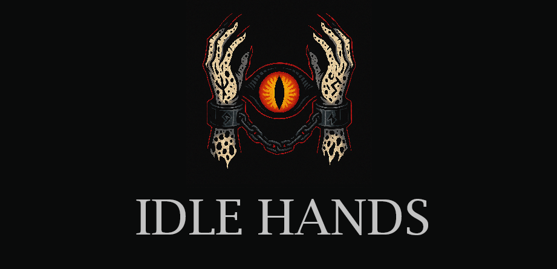

**"Because Discipline is best enforced by a daemon with attitude."**

Idle Hands is a local monitoring and behavior-feedback system for productivity, self-regulation, and voluntary techno-masochism. It tracks your activity, enforces focus, and if properly integrated, can issue escalating punishments.

This is not your average productivity monitoring tool. It's a panopticon. And you're the inmate.

---

## Roadmap

TODO

---

## Philosophy

Idle Hands isn't about "nudging."
It's about **punishing sloth.**
It's not "gamified productivity."
It's a **systematic behavioral correction protocol** wrapped in sass and fire.

> _"Motivation is unreliable. Discipline is engineered."_

---

## Getting Started

1. Clone the repo
2. Install dependencies (Python / Node / whatever this mess runs on)
3. Run the daemon
4. Configure thresholds and preferred punishment types
5. Cry

```bash
git clone https://github.com/yourname/idlehands
cd idlehands
# Install Dependencies
# Run main process
```

---

## Contributing

Don't. This project is tailored to a specific combination of shame, masochism, and misplaced ambition.

## License

MIT. Because even suffering should be open source.